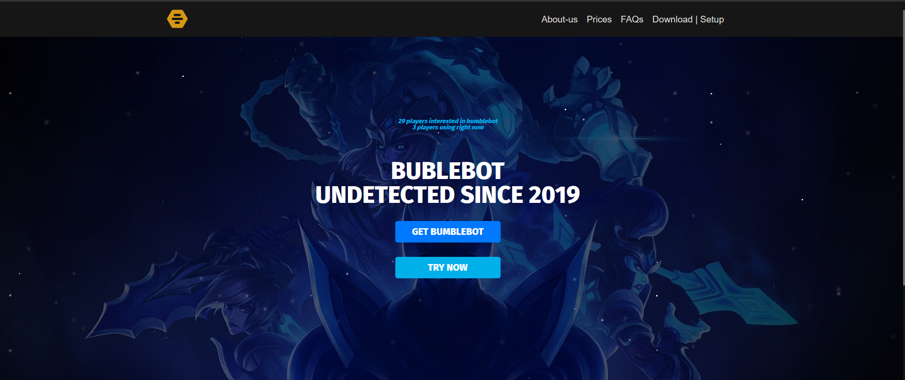
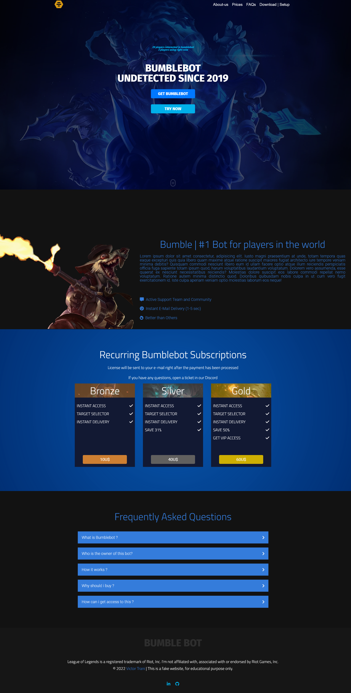

# Bumblebot Website

This is a project made for test some sass skills. I found this landing page on the Internet  and try to copy.

I've used JavaScript, sass and fetch API (js). The challenge in this project was to create the particles effect in the header using @keyframes.

## Demo

*Particle effect in header*

*Full Page*

## How to use?

Just follow this [link](https://bumblebot.netlify.app/).

